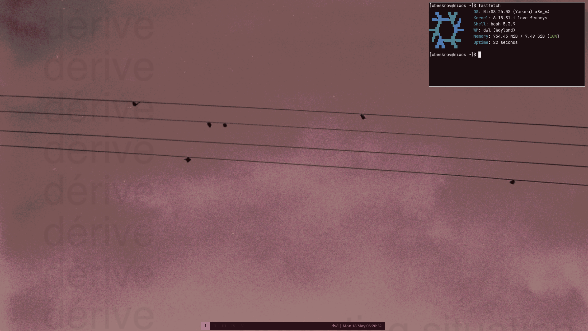

# nixos-backup

my personal nixos dotfiles — a minimal wayland setup built around dwl. nothing fancy, just what works for me.



---

## stack

| role | tool |
|---|---|
| os | NixOS 26.05 (flakes) |
| wm | dwl (wayland, tiling) |
| bar | waybar |
| terminal | foot |
| launcher | bemenu |
| editor | neovim |
| browser | brave |
| files | thunar |
| audio | pipewire + pavucontrol |
| screenshots | grim + slurp |
| wallpaper | swaybg |

---

## keybinds

`Super` = Windows key

### apps

| key | action |
|---|---|
| `Super + Enter` | terminal (foot) |
| `Super + D` | launcher (bemenu) |
| `Super + W` | wallpaper selector |
| `Super + B` | browser (brave) |
| `Super + E` | file manager (thunar) |
| `Super + V` | volume control (pavucontrol) |
| `Super + Shift + D` | discord |
| `Super + Shift + S` | spotify |
| `Super + Shift + X` | sober (roblox) |
| `Super + Ctrl + S` | area screenshot |

### window management

| key | action |
|---|---|
| `Super + Q` | close window |
| `Super + J / K` | focus next / prev window |
| `Super + H / L` | resize master area |
| `Super + Shift + Space` | toggle floating |
| `Super + Shift + F` | toggle fullscreen |
| `Super + I` | toggle waybar |
| `Super + Tab` | switch to previous tag |

### layouts

| key | layout |
|---|---|
| `Super + T` | tiling |
| `Super + F` | floating |
| `Super + M` | monocle |

### tags (workspaces)

| key | action |
|---|---|
| `Super + 1-5` | go to tag |
| `Super + Ctrl + 1-5` | show additional tag |
| `Super + Shift + 1-5` | move window to tag |
| `Super + 0` | show all tags |

### mouse

| combo | action |
|---|---|
| `Super + left click` | move window |
| `Super + right click` | resize window |
| `Super + middle click` | toggle floating |

### media and system

| key | action |
|---|---|
| `XF86AudioRaiseVolume` | volume up |
| `XF86AudioLowerVolume` | volume down |
| `XF86AudioMute` | mute |
| `XF86MonBrightnessUp/Down` | brightness |
| `XF86AudioPlay/Next/Prev` | media controls |
| `Super + Shift + Q` | quit dwl |

---

## structure

```
nixos-backup/
├── configuration.nix   # system config
├── flake.nix           # flake inputs (nixpkgs + home-manager)
├── flake.lock
├── home.nix            # home-manager config
├── config.h            # dwl keybinds + rules
├── nvim/
│   └── init.lua        # neovim (lazy + lsp + treesitter)
├── waybar/
│   ├── config
│   └── style.css
├── fastfetch/
│   └── config.jsonc
├── foot/
│   └── foot.ini
└── bin/
    └── screenshot-swappy
```

---

## install

```bash
git clone https://github.com/taakenvx/nixos-backup
cd nixos-backup
sudo cp configuration.nix flake.nix flake.lock home.nix /etc/nixos/
sudo nixos-rebuild switch --flake /etc/nixos#nixos
```

dwl needs to be compiled manually — check `config.h` for dependencies.

---

*README.md by Claude AI*
